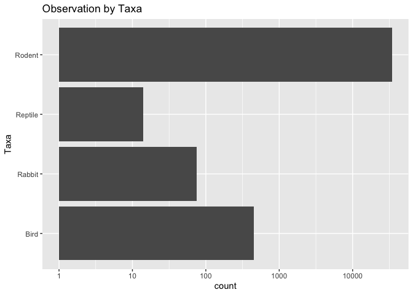
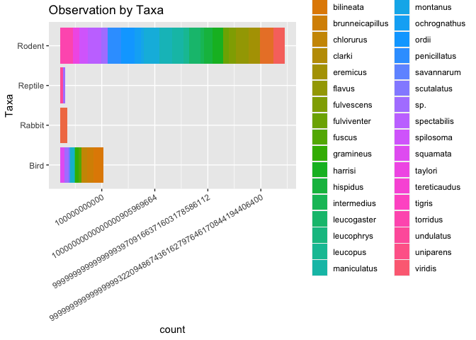
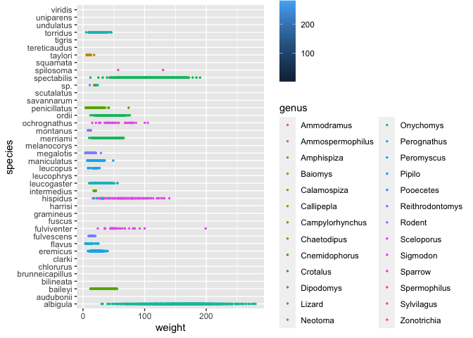
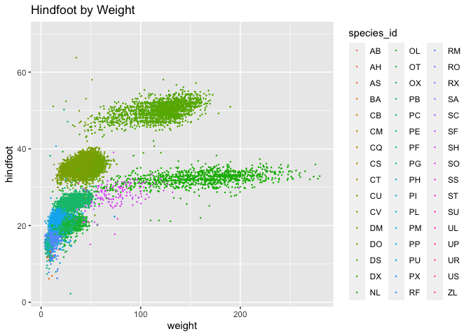
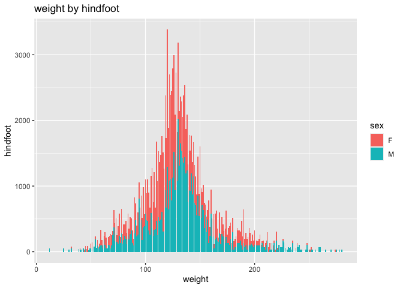
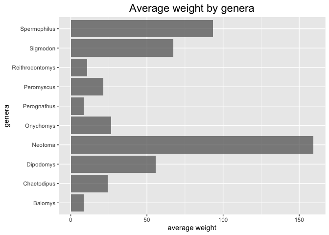

## Instructions
Answer the following questions and complete the exercises in RMarkdown. Please embed all of your code and push your final work to your repository. Your final lab report should be organized, clean, and run free from errors. Remember, you must remove the `#` for the included code chunks to run. Be sure to add your name to the author header above. For any included plots, make sure they are clearly labeled. You are free to use any plot type that you feel best communicates the results of your analysis.  

Make sure to use the formatting conventions of RMarkdown to make your report neat and clean!  

## Load the libraries

```r
library(tidyverse)
library(janitor)
library(naniar)
```


```r
options(scipen=999)
```

## Desert Ecology
For this assignment, we are going to use a modified data set on [desert ecology](http://esapubs.org/archive/ecol/E090/118/). The data are from: S. K. Morgan Ernest, Thomas J. Valone, and James H. Brown. 2009. Long-term monitoring and experimental manipulation of a Chihuahuan Desert ecosystem near Portal, Arizona, USA. Ecology 90:1708.

```r
deserts <- read_csv("data/surveys_complete.csv") %>% clean_names()
```

```
## Rows: 34786 Columns: 13
## ── Column specification ────────────────────────────────────────────────────────
## Delimiter: ","
## chr (6): species_id, sex, genus, species, taxa, plot_type
## dbl (7): record_id, month, day, year, plot_id, hindfoot_length, weight
## 
## ℹ Use `spec()` to retrieve the full column specification for this data.
## ℹ Specify the column types or set `show_col_types = FALSE` to quiet this message.
```

1. Use the function(s) of your choice to get an idea of its structure, including how NA's are treated. Are the data tidy?  

```r
glimpse(deserts)
```

```
## Rows: 34,786
## Columns: 13
## $ record_id       <dbl> 1, 2, 3, 4, 5, 6, 7, 8, 9, 10, 11, 12, 13, 14, 15, 16,…
## $ month           <dbl> 7, 7, 7, 7, 7, 7, 7, 7, 7, 7, 7, 7, 7, 7, 7, 7, 7, 7, …
## $ day             <dbl> 16, 16, 16, 16, 16, 16, 16, 16, 16, 16, 16, 16, 16, 16…
## $ year            <dbl> 1977, 1977, 1977, 1977, 1977, 1977, 1977, 1977, 1977, …
## $ plot_id         <dbl> 2, 3, 2, 7, 3, 1, 2, 1, 1, 6, 5, 7, 3, 8, 6, 4, 3, 2, …
## $ species_id      <chr> "NL", "NL", "DM", "DM", "DM", "PF", "PE", "DM", "DM", …
## $ sex             <chr> "M", "M", "F", "M", "M", "M", "F", "M", "F", "F", "F",…
## $ hindfoot_length <dbl> 32, 33, 37, 36, 35, 14, NA, 37, 34, 20, 53, 38, 35, NA…
## $ weight          <dbl> NA, NA, NA, NA, NA, NA, NA, NA, NA, NA, NA, NA, NA, NA…
## $ genus           <chr> "Neotoma", "Neotoma", "Dipodomys", "Dipodomys", "Dipod…
## $ species         <chr> "albigula", "albigula", "merriami", "merriami", "merri…
## $ taxa            <chr> "Rodent", "Rodent", "Rodent", "Rodent", "Rodent", "Rod…
## $ plot_type       <chr> "Control", "Long-term Krat Exclosure", "Control", "Rod…
```

2. How many genera and species are represented in the data? What are the total number of observations? Which species is most/ least frequently sampled in the study?  

There are 26 genera and 40 species. There are 34786 total of observations. Most frequently sampled species is merriami, least frequently sampled species are clarki, scutalatus, tereticaudus, tigris, uniparens, and viridis. 

```r
str(deserts)
```

```
## spc_tbl_ [34,786 × 13] (S3: spec_tbl_df/tbl_df/tbl/data.frame)
##  $ record_id      : num [1:34786] 1 2 3 4 5 6 7 8 9 10 ...
##  $ month          : num [1:34786] 7 7 7 7 7 7 7 7 7 7 ...
##  $ day            : num [1:34786] 16 16 16 16 16 16 16 16 16 16 ...
##  $ year           : num [1:34786] 1977 1977 1977 1977 1977 ...
##  $ plot_id        : num [1:34786] 2 3 2 7 3 1 2 1 1 6 ...
##  $ species_id     : chr [1:34786] "NL" "NL" "DM" "DM" ...
##  $ sex            : chr [1:34786] "M" "M" "F" "M" ...
##  $ hindfoot_length: num [1:34786] 32 33 37 36 35 14 NA 37 34 20 ...
##  $ weight         : num [1:34786] NA NA NA NA NA NA NA NA NA NA ...
##  $ genus          : chr [1:34786] "Neotoma" "Neotoma" "Dipodomys" "Dipodomys" ...
##  $ species        : chr [1:34786] "albigula" "albigula" "merriami" "merriami" ...
##  $ taxa           : chr [1:34786] "Rodent" "Rodent" "Rodent" "Rodent" ...
##  $ plot_type      : chr [1:34786] "Control" "Long-term Krat Exclosure" "Control" "Rodent Exclosure" ...
##  - attr(*, "spec")=
##   .. cols(
##   ..   record_id = col_double(),
##   ..   month = col_double(),
##   ..   day = col_double(),
##   ..   year = col_double(),
##   ..   plot_id = col_double(),
##   ..   species_id = col_character(),
##   ..   sex = col_character(),
##   ..   hindfoot_length = col_double(),
##   ..   weight = col_double(),
##   ..   genus = col_character(),
##   ..   species = col_character(),
##   ..   taxa = col_character(),
##   ..   plot_type = col_character()
##   .. )
##  - attr(*, "problems")=<externalptr>
```


```r
deserts %>% 
  group_by(species) %>% 
  count(species) %>% 
  arrange(desc(n))
```

```
## # A tibble: 40 × 2
## # Groups:   species [40]
##    species          n
##    <chr>        <int>
##  1 merriami     10596
##  2 penicillatus  3123
##  3 ordii         3027
##  4 baileyi       2891
##  5 megalotis     2609
##  6 spectabilis   2504
##  7 torridus      2249
##  8 flavus        1597
##  9 eremicus      1299
## 10 albigula      1252
## # ℹ 30 more rows
```


```r
deserts %>% 
  group_by(species) %>% 
  count(species) %>% 
  arrange(n)
```

```
## # A tibble: 40 × 2
## # Groups:   species [40]
##    species          n
##    <chr>        <int>
##  1 clarki           1
##  2 scutalatus       1
##  3 tereticaudus     1
##  4 tigris           1
##  5 uniparens        1
##  6 viridis          1
##  7 leucophrys       2
##  8 savannarum       2
##  9 fuscus           5
## 10 undulatus        5
## # ℹ 30 more rows
```

```r
deserts %>% 
  group_by(genus) %>% 
  count(genus) %>% 
  arrange(desc(n))
```

```
## # A tibble: 26 × 2
## # Groups:   genus [26]
##    genus                n
##    <chr>            <int>
##  1 Dipodomys        16167
##  2 Chaetodipus       6029
##  3 Onychomys         3267
##  4 Reithrodontomys   2694
##  5 Peromyscus        2234
##  6 Perognathus       1629
##  7 Neotoma           1252
##  8 Ammospermophilus   437
##  9 Amphispiza         303
## 10 Spermophilus       249
## # ℹ 16 more rows
```

3. What is the proportion of taxa included in this study? Show a table and plot that reflects this count.

```r
deserts %>% 
  ggplot(aes(x=taxa))+
  geom_bar()+
  coord_flip()+
  labs(title="Observation by Taxa", 
       x="Taxa")+
  scale_y_log10()
```

<!-- -->
4. For the taxa included in the study, use the fill option to show the proportion of individuals sampled by `plot_type.`

```r
deserts %>% 
  ggplot(aes(x=taxa, fill=species))+
  geom_bar()+
  coord_flip()+
  labs(title="Observation by Taxa", 
       x="Taxa", 
       fill="Species by Color")+
  scale_y_log10()+
  theme(axis.text.x = element_text(angle = 30, hjust = 1))
```

<!-- -->

5. What is the range of weight for each species included in the study? Remove any observations of weight that are NA so they do not show up in the plot.

```r
deserts %>% 
  ggplot(aes(x=species, y=weight, fill=weight))+
  geom_boxplot(na.rm = T)+
  coord_flip()
```

```
## Warning: The following aesthetics were dropped during statistical transformation: fill
## ℹ This can happen when ggplot fails to infer the correct grouping structure in
##   the data.
## ℹ Did you forget to specify a `group` aesthetic or to convert a numerical
##   variable into a factor?
```

<!-- -->

6. Add another layer to your answer from #5 using `geom_point` to get an idea of how many measurements were taken for each species.

```r
deserts %>% 
  ggplot(aes(x=species, y=weight, fill=weight,color=genus))+
  geom_point(na.rm = T, size=0.5)+
  coord_flip()
```

<!-- -->

7. [Dipodomys merriami](https://en.wikipedia.org/wiki/Merriam's_kangaroo_rat) is the most frequently sampled animal in the study. How have the number of observations of this species changed over the years included in the study?

```r
deserts %>% 
  filter(species=="merriami") %>% 
  group_by(year) %>% 
  ggplot(aes(x=year))+
  geom_bar(na.rm = T)
```

<!-- -->

8. What is the relationship between `weight` and `hindfoot` length? Consider whether or not over plotting is an issue.

```r
deserts %>% 
  ggplot(aes(x=weight, y=hindfoot_length, color=species_id))+
  geom_jitter(na.rm = T, size=0.1)+
  labs(title = "Hindfoot by Weight", 
       y="hindfoot")
```

<!-- -->

9. Which two species have, on average, the highest weight? Once you have identified them, make a new column that is a ratio of `weight` to `hindfoot_length`. Make a plot that shows the range of this new ratio and fill by sex.

```r
deserts %>% 
  group_by(species) %>% 
  summarise(mean_w=mean(weight, na.rm = T)) %>% 
  arrange(desc(mean_w))
```

```
## # A tibble: 40 × 2
##    species      mean_w
##    <chr>         <dbl>
##  1 albigula      159. 
##  2 spectabilis   120. 
##  3 spilosoma      93.5
##  4 hispidus       65.6
##  5 fulviventer    58.9
##  6 ochrognathus   55.4
##  7 ordii          48.9
##  8 merriami       43.2
##  9 baileyi        31.7
## 10 leucogaster    31.6
## # ℹ 30 more rows
```


```r
deserts %>% 
  filter(species=="albigula" | species=="spectabilis") %>% 
  filter(sex!= "NA") %>% 
  ggplot(aes(x=weight, y=hindfoot_length, fill=sex))+
  geom_col(na.rm = T)+
  labs(title = "weight by hindfoot",
       y="hindfoot")
```

```
## Warning: Removed 567 rows containing missing values (`position_stack()`).
```

<!-- -->

10. Make one plot of your choice! Make sure to include at least two of the aesthetics options you have learned.

```r
deserts %>% 
  group_by(genus) %>% 
  summarise(mean_w=mean(weight, na.rm = T)) %>% 
  filter(mean_w!="NaN") %>% 
  ggplot(aes(x=genus, y=mean_w))+
  geom_col(alpha=0.7)+
  coord_flip()+
  labs(title = "Average weight by genera",
       x="genera", 
       y="average weight")+
  theme(plot.title=element_text(size = rel(1.5),hjust = 0.5)) 
```

<!-- -->

## Push your final code to GitHub!
Please be sure that you check the `keep md` file in the knit preferences. 
