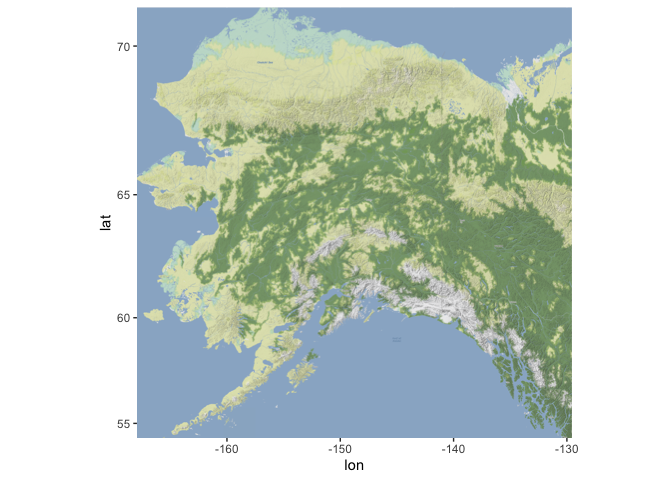
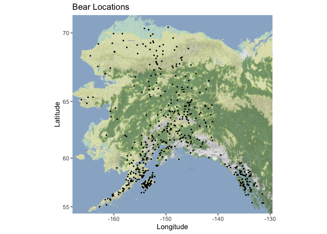
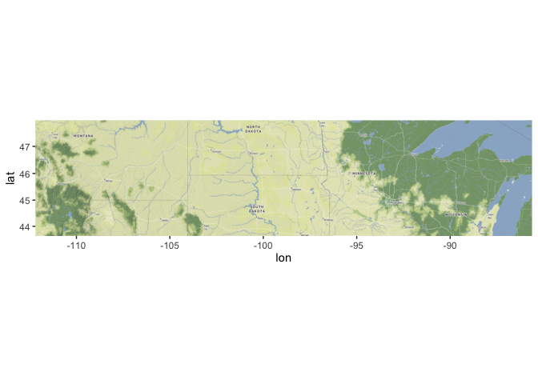
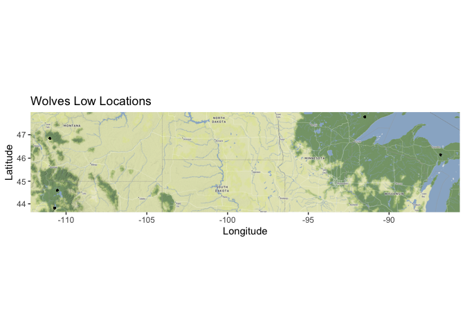
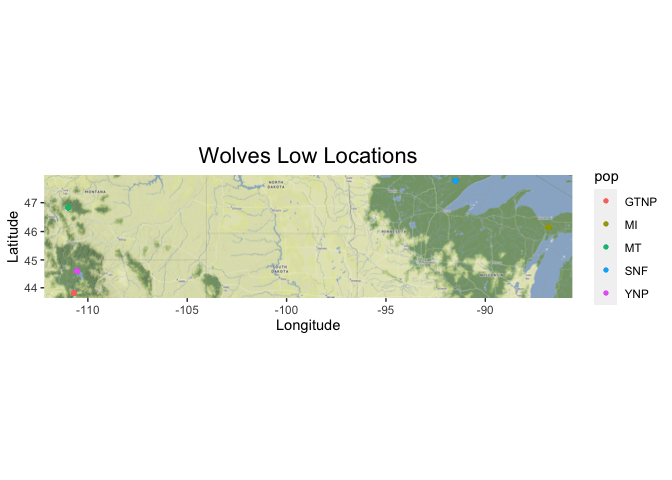

## Instructions
Answer the following questions and complete the exercises in RMarkdown. Please embed all of your code and push your final work to your repository. Your final lab report should be organized, clean, and run free from errors. Remember, you must remove the `#` for the included code chunks to run. Be sure to add your name to the author header above. For any included plots, make sure they are clearly labeled. You are free to use any plot type that you feel best communicates the results of your analysis.  

Make sure to use the formatting conventions of RMarkdown to make your report neat and clean!  

## Load the libraries  

```r
library(tidyverse)
library(janitor)
library(ggmap)
```

## Load the Data
We will use two separate data sets for this homework.  

1. The first [data set](https://rcweb.dartmouth.edu/~f002d69/workshops/index_rspatial.html) represent sightings of grizzly bears (Ursos arctos) in Alaska.  

2. The second data set is from Brandell, Ellen E (2021), Serological dataset and R code for: Patterns and processes of pathogen exposure in gray wolves across North America, Dryad, [Dataset](https://doi.org/10.5061/dryad.5hqbzkh51).  

1. Load the `grizzly` data and evaluate its structure.  

```r
grizzly <- read.csv("data/bear-sightings.csv") %>% clean_names()
```

2. Use the range of the latitude and longitude to build an appropriate bounding box for your map.  

```r
summary(grizzly)
```

```
##     bear_id       longitude         latitude    
##  Min.   :   7   Min.   :-166.2   Min.   :55.02  
##  1st Qu.:2569   1st Qu.:-154.2   1st Qu.:58.13  
##  Median :4822   Median :-151.0   Median :60.97  
##  Mean   :4935   Mean   :-149.1   Mean   :61.41  
##  3rd Qu.:7387   3rd Qu.:-145.6   3rd Qu.:64.13  
##  Max.   :9996   Max.   :-131.3   Max.   :70.37
```


```r
lat<- c(55.02, 70.37)
long<- c(-166.2, -131.3)
bbox <- make_bbox(long, lat, f = 0.05)
```

3. Load a map from `stamen` in a terrain style projection and display the map.  

```r
map1 <- get_stadiamap(bbox, maptype = "stamen_terrain", zoom=7)
```

```
## ℹ © Stadia Maps © Stamen Design © OpenMapTiles © OpenStreetMap contributors.
```

```
## ℹ 196 tiles needed, this may take a while (try a smaller zoom?)
```


```r
ggmap(map1)
```

<!-- -->

4. Build a final map that overlays the recorded observations of grizzly bears in Alaska.  

```r
ggmap(map1) + 
  geom_point(data = grizzly, aes(longitude, latitude), size=0.4) +
  labs(x= "Longitude", y= "Latitude", title="Bear Locations")
```

<!-- -->

Let's switch to the wolves data. Brandell, Ellen E (2021), Serological dataset and R code for: Patterns and processes of pathogen exposure in gray wolves across North America, Dryad, [Dataset](https://doi.org/10.5061/dryad.5hqbzkh51).  

5. Load the data and evaluate its structure.  

```r
wolves <- read.csv("data/wolves_data/wolves_dataset.csv")
```


```r
glimpse(wolves)
```

```
## Rows: 1,986
## Columns: 23
## $ pop                <chr> "AK.PEN", "AK.PEN", "AK.PEN", "AK.PEN", "AK.PEN", "…
## $ year               <int> 2006, 2006, 2006, 2006, 2006, 2006, 2006, 2006, 200…
## $ age.cat            <chr> "S", "S", "A", "S", "A", "A", "A", "P", "S", "P", "…
## $ sex                <chr> "F", "M", "F", "M", "M", "M", "F", "M", "F", "M", "…
## $ color              <chr> "G", "G", "G", "B", "B", "G", "G", "G", "G", "G", "…
## $ lat                <dbl> 57.03983, 57.03983, 57.03983, 57.03983, 57.03983, 5…
## $ long               <dbl> -157.8427, -157.8427, -157.8427, -157.8427, -157.84…
## $ habitat            <dbl> 254.08, 254.08, 254.08, 254.08, 254.08, 254.08, 254…
## $ human              <dbl> 10.42, 10.42, 10.42, 10.42, 10.42, 10.42, 10.42, 10…
## $ pop.density        <dbl> 8, 8, 8, 8, 8, 8, 8, 8, 8, 8, 8, 8, 8, 8, 8, 8, 8, …
## $ pack.size          <dbl> 8.78, 8.78, 8.78, 8.78, 8.78, 8.78, 8.78, 8.78, 8.7…
## $ standard.habitat   <dbl> -1.6339, -1.6339, -1.6339, -1.6339, -1.6339, -1.633…
## $ standard.human     <dbl> -0.9784, -0.9784, -0.9784, -0.9784, -0.9784, -0.978…
## $ standard.pop       <dbl> -0.6827, -0.6827, -0.6827, -0.6827, -0.6827, -0.682…
## $ standard.packsize  <dbl> 1.3157, 1.3157, 1.3157, 1.3157, 1.3157, 1.3157, 1.3…
## $ standard.latitude  <dbl> 0.7214, 0.7214, 0.7214, 0.7214, 0.7214, 0.7214, 0.7…
## $ standard.longitude <dbl> -2.1441, -2.1441, -2.1441, -2.1441, -2.1441, -2.144…
## $ cav.binary         <int> 1, 1, 1, 0, 1, 1, 1, 1, 1, 1, 1, 1, 1, 1, 1, 1, 1, …
## $ cdv.binary         <int> 0, 0, 0, 0, 0, 1, 0, 0, 0, 0, 0, 0, 0, 0, 0, 0, 0, …
## $ cpv.binary         <int> 0, 0, 1, 1, 0, 1, 0, 0, 0, 0, 1, 0, 0, 1, 0, 0, 0, …
## $ chv.binary         <int> 1, 1, 1, 1, 1, 1, 1, 1, 1, 0, 1, 1, 1, 1, 1, 1, 1, …
## $ neo.binary         <int> NA, NA, NA, 0, 0, NA, NA, 1, 0, 1, NA, 0, NA, NA, N…
## $ toxo.binary        <int> NA, NA, NA, 1, 0, NA, NA, 1, 0, 0, NA, 0, NA, NA, N…
```

6. How many distinct wolf populations are included in this study? Mae a new object that restricts the data to the wolf populations in the lower 48 US states.  

```r
wolves_low <- filter(wolves, pop %in% c("MT", "YNP", "GTNP", "SNF", "MI"))
```

7. Use the range of the latitude and longitude to build an appropriate bounding box for your map. 

```r
wolves_low %>% 
  select(pop, lat, long) %>% 
  summary()
```

```
##      pop                 lat             long        
##  Length:988         Min.   :43.82   Min.   :-110.99  
##  Class :character   1st Qu.:44.60   1st Qu.:-110.99  
##  Mode  :character   Median :46.15   Median :-110.55  
##                     Mean   :45.80   Mean   :-106.49  
##                     3rd Qu.:46.83   3rd Qu.:-110.55  
##                     Max.   :47.75   Max.   : -86.82
```

```r
lat2 <- c(43.82, 47.75)
long2 <- c(-110.99, -86.82)
bbox2 <- make_bbox(long2, lat2, f = 0.05)
```

8.  Load a map from `stamen` in a `terrain-lines` projection and display the map.  

```r
map2 <- get_stadiamap(bbox2, maptype = "stamen_terrain", zoom=7)
```

```
## ℹ © Stadia Maps © Stamen Design © OpenMapTiles © OpenStreetMap contributors.
```

```r
ggmap(map2)
```

<!-- -->

9. Build a final map that overlays the recorded observations of wolves in the lower 48 states.  

```r
ggmap(map2) + 
  geom_point(data = wolves_low, aes(long, lat), size=0.4) +
  labs(x= "Longitude", y= "Latitude", title="Wolves Low Locations")
```

<!-- -->

10. Use the map from #9 above, but add some aesthetics. Try to `fill` and `color` by population.  

```r
ggmap(map2) + 
  geom_point(data = wolves_low, aes(long, lat, color=pop), size=1.2) +
  labs(x= "Longitude", y= "Latitude", title="Wolves Low Locations")+
  theme(plot.title=element_text(size = rel(1.5),hjust = 0.5))
```

<!-- -->

## Push your final code to GitHub!
Please be sure that you check the `keep md` file in the knit preferences. 
