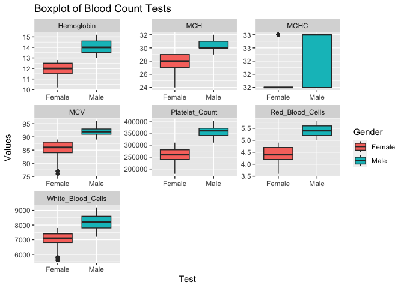
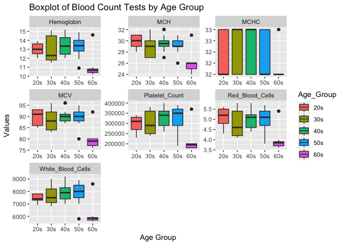

## Instructions
This homework is a bit less traditional this week. There are some errors in the code below. In addition add notes and titles to the code chunks that explains what the code chunck does. Use AI tools, notes from class, or any other resources to help fix the errors. Feel free to edit any plots to your preference. Don't forget to answer the two questions at the bottom. Upon completion, you should not have to '#' out any of the code chunks.

Push your final work to your repository. Your final lab report should be organized, clean, and run free from errors. Remember, you must remove the `#` for the included code chunks to run. Be sure to add your name to the author header above.   

Again make sure to use the formatting conventions of RMarkdown to make your report neat and clean!  


```r
library(tidyverse)
```

```
## ── Attaching core tidyverse packages ──────────────────────── tidyverse 2.0.0 ──
## ✔ dplyr     1.1.4     ✔ readr     2.1.4
## ✔ forcats   1.0.0     ✔ stringr   1.5.1
## ✔ ggplot2   3.4.4     ✔ tibble    3.2.1
## ✔ lubridate 1.9.3     ✔ tidyr     1.3.0
## ✔ purrr     1.0.2     
## ── Conflicts ────────────────────────────────────────── tidyverse_conflicts() ──
## ✖ dplyr::filter() masks stats::filter()
## ✖ dplyr::lag()    masks stats::lag()
## ℹ Use the conflicted package (<http://conflicted.r-lib.org/>) to force all conflicts to become errors
```

```r
library(janitor)
```

```
## 
## Attaching package: 'janitor'
## 
## The following objects are masked from 'package:stats':
## 
##     chisq.test, fisher.test
```

```r
library(dplyr)
```


1. import csv data.   

```r
blood_count <- read_csv("data/blood_count_dataset.csv") #check the name of the csv file
```

```
## Rows: 417 Columns: 9
## ── Column specification ────────────────────────────────────────────────────────
## Delimiter: ","
## chr (1): Gender
## dbl (8): Age, Hemoglobin, Platelet_Count, White_Blood_Cells, Red_Blood_Cells...
## 
## ℹ Use `spec()` to retrieve the full column specification for this data.
## ℹ Specify the column types or set `show_col_types = FALSE` to quiet this message.
```

2. see how the data set look like.  

```r
glimpse(blood_count) #miss spell the function name
```

```
## Rows: 417
## Columns: 9
## $ Age               <dbl> 68, 25, 57, 28, 38, 47, 37, 30, 35, 22, 41, 34, 40, …
## $ Gender            <chr> "Female", "Male", "Male", "Female", "Male", "Female"…
## $ Hemoglobin        <dbl> 10.4, 13.8, 13.5, 12.7, 14.9, 12.0, 14.5, 11.8, 11.5…
## $ Platelet_Count    <dbl> 180000, 320000, 370000, 290000, 380000, 260000, 3800…
## $ White_Blood_Cells <dbl> 5700, 7500, 8500, 7800, 8700, 7000, 8700, 7000, 7100…
## $ Red_Blood_Cells   <dbl> 3.7, 5.4, 5.1, 4.8, 5.7, 4.4, 5.7, 4.2, 4.2, 5.6, 4.…
## $ MCV               <dbl> 77, 92, 90, 86, 95, 87, 95, 84, 84, 93, 88, 85, 96, …
## $ MCH               <dbl> 25, 30, 29, 29, 31, 28, 31, 27, 27, 31, 29, 28, 32, …
## $ MCHC              <dbl> 32, 32, 32, 33, 33, 32, 33, 32, 32, 32, 33, 32, 33, …
```

3. find out the min, mean, and max of count of red blood cell by gender.  

```r
blood_count %>% 
  clean_names() %>% #need clean names before analyze tidy data. 
  group_by(gender) %>% 
  summarize(min=min(red_blood_cells),
            mean=mean(red_blood_cells),#miss spell mean function
            max=max(red_blood_cells)) #need end parenthesis for function 'summarize'
```

```
## # A tibble: 2 × 4
##   gender   min  mean   max
##   <chr>  <dbl> <dbl> <dbl>
## 1 Female   3.6  4.36   4.9
## 2 Male     5    5.38   5.8
```


4. find the average of each variable for male except age.  

```r
options(scipen = 999, digits = 2)

blood_count %>% 
  filter(Gender == "male") %>% #change '=' to '=='
  select(3:9) %>% #change bracket to parentheses
  colMeans(na.rm = TRUE)
```

```
##        Hemoglobin    Platelet_Count White_Blood_Cells   Red_Blood_Cells 
##               NaN               NaN               NaN               NaN 
##               MCV               MCH              MCHC 
##               NaN               NaN               NaN
```

5. find the average of each variable for female except age.  

```r
blood_count %>% #miss spell object name
  filter(Gender == "Female") %>% #miss spell pipet %>%, change '=' to '=='
  select(3:9) %>% #change bracket to parentheses
  colMeans(na.rm = T)
```

```
##        Hemoglobin    Platelet_Count White_Blood_Cells   Red_Blood_Cells 
##              11.9          255913.5            6967.8               4.4 
##               MCV               MCH              MCHC 
##              84.9              27.7              32.2
```


6. make a box plot of each blood count variable by gender.  

```r
blood_count %>%
  pivot_longer(cols = (3:9), names_to = "Test", values_to = "Values") %>% #change bracket to parentheses for cols, change pivot wider to pivot longer
  ggplot(aes(x = Gender, y = Values, fill = Gender)) +
  geom_boxplot() +
  facet_wrap(~ Test, scales = "free") + #'+' needed for ggplot2
  labs(title = "Boxplot of Blood Count Tests",
       x = "Test",
       y = "Values")
```

<!-- -->

7. add a new column to seperate age range. Bind people over 70s to 60s.   

```r
grouped_bc <- blood_count %>%
  mutate(Age_Group = case_when( #'change' to 'mutate'
    Age >= 20 & Age <= 29 ~ "20s",
    Age >= 30 & Age <= 39 ~ "30s",
    Age >= 40 & Age <= 49 ~ "40s",
    Age >= 50 & Age <= 59 ~ "50s",
    Age >= 60 ~ "60s")) # there were only 4 people in 70s, so I combined it with 60s, remove '& Age <= 70'

head(grouped_bc)
```

```
## # A tibble: 6 × 10
##     Age Gender Hemoglobin Platelet_Count White_Blood_Cells Red_Blood_Cells   MCV
##   <dbl> <chr>       <dbl>          <dbl>             <dbl>           <dbl> <dbl>
## 1    68 Female       10.4         180000              5700             3.7    77
## 2    25 Male         13.8         320000              7500             5.4    92
## 3    57 Male         13.5         370000              8500             5.1    90
## 4    28 Female       12.7         290000              7800             4.8    86
## 5    38 Male         14.9         380000              8700             5.7    95
## 6    47 Female       12           260000              7000             4.4    87
## # ℹ 3 more variables: MCH <dbl>, MCHC <dbl>, Age_Group <chr>
```

8. show the blood count of each variable by age group.  

```r
grouped_bc %>% #use new created data 
  pivot_longer(cols = (3:9), names_to = "Test", values_to = "Values") %>% #add parentheses for function 'col()'
  ggplot(aes(x = Age_Group, y = Values, fill = Age_Group)) + #miss spell aes, capitalize 'values'
  geom_boxplot() +
  facet_wrap( ~Test, scales = "free") +  # Facet by the "Test" variable, add '~' before Test
  labs(title = "Boxplot of Blood Count Tests by Age Group",
       x = "Age Group",
       y = "Values")
```

<!-- -->
9. What are two drawbacks and two benefits of AI?
Drawback: having bias after trained and job displacement. 
Benefit: efficiency and quick decision making based on data.   

10. Do you think you will use AI for coding in the future? Why or why not?
Yes, I will use AI for coding in the future. It saves time for finding error in my code. It also helps to reminding me the function that is good to use.  

## Push your final code to GitHub!
Please be sure that you check the `keep md` file in the knit preferences. 
